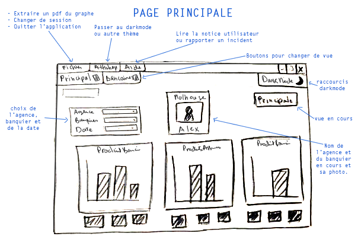
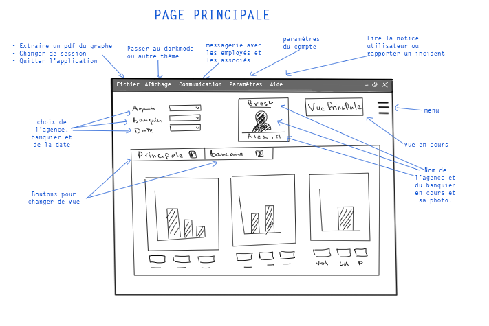
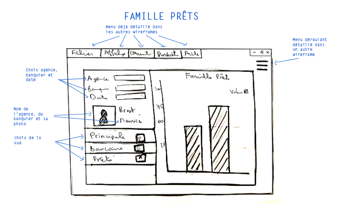
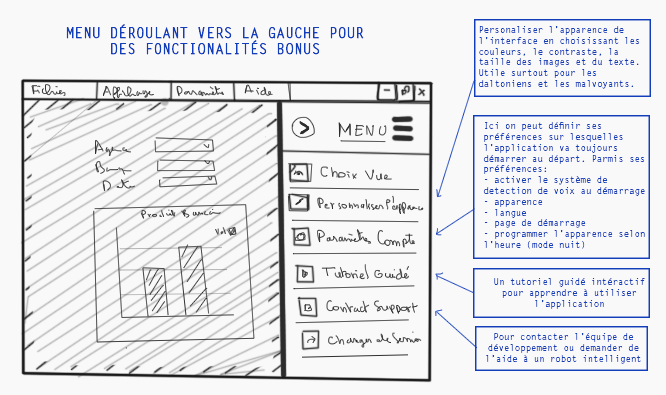
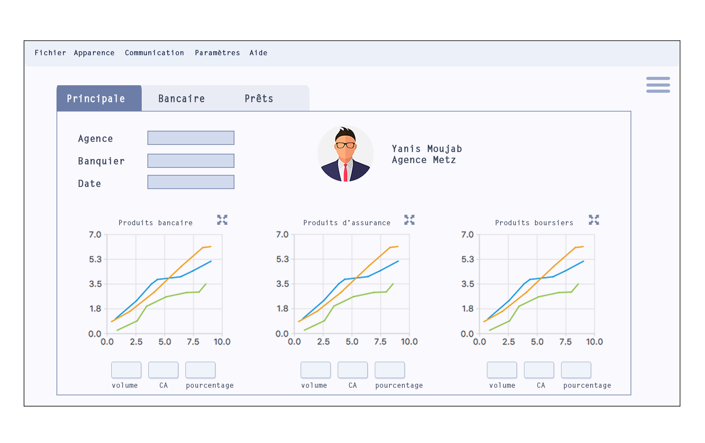
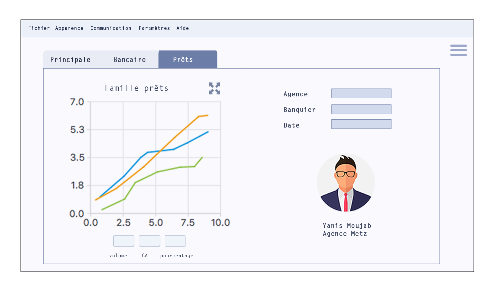
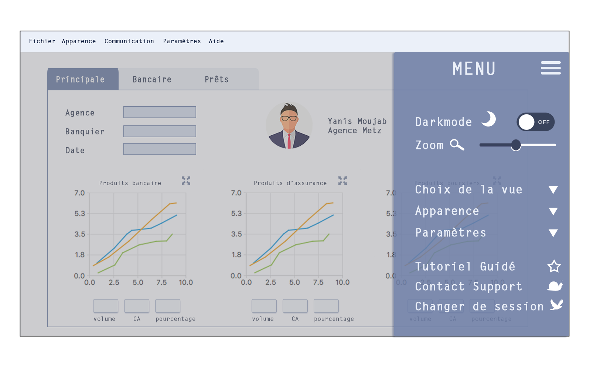

**Projet IHM**
=============
**Siham JANATI**
-------------

***

### __Présentation du projet__

Le but de ce projet est de concevoir une application pour une banque qui permettrait une visualisation des performances des différentes agences et des employés, et qui permettrait aussi à un banquier de voir ces performances personelles.  
La réunion avec le directeur de la banque a donné lieu à la spécification que l'on présentera dans la prochaine partie. Les points les plus importants à respecter sont les suivants:  
 + Avoir une vue principale pour les performances des trois canaux séparément: bancaires, assurances et boursiers.
 + Avoir une vue détaillée pour le canal bancaire
 + Permettre de voir les performances sur une durée déterminée
 + une IHM accessible à des utilisateurs aux besoins spécifiques
 + Le mode sombre  
 + Possibilité de voir les performances d'une agence en particulier, ou d'un employé, ou l'ensemble de leurs performances.  

***

### __Guide d'utilisation de l'Interface__   
L'application se lance sur une fenêtre de connexion.   

*Pour démarrer la session du président:*  
- Login: **président**  
- Mot-de-passe: (vide)  

*Pour démarrer la session du banquier:*  
- Login: **banquier**   
- Mot-de-passe: (vide)  

*Pour démarrer la session d'une agence:*
- Login: **agence**
- Mot-de-passe: (vide)    

*NB: la session de l'agence est pareille que celle d'un banquier par contrainte de temps. Elle devrait normalement démarrer sur la vue d'une agence.*

Un login et un mot-de-passe vide permettent aussi d'ouvrir la session du président, tandis que tout autre identifiants et mot-de-passe génèrent un message d'erreur.  

***

## __Les différentes phases du projet :__

Nous avons suivi un processus incrémental. Tout d'abord, la spécification d'une IHM basique, le dessin des Wireframes, puis dessiner l'interface sur QT Designer.
Ensuite, la spécification de la couche logique, et son implémentation sur QT. Et finalement, l'ajout d'éléments bonus à l'IHM, leur intégration à la couche logique et les modifications nécessaires à l'IHM de base pour y intégrer les nouveaux éléments.  

***

### __Phase 1: Spécification de l'IHM__    

Le but est de concevoir une IHM qui répond d'abord aux critères définies précedemment, et de prendre en considération les points suivants:  
* Elle doit être ergonomique et facile d'utilisation. L'utilisateur ne doit pas perdre son temps à naviguer l'application. Les élèments essentiels comme le choix de la vue, de l'agence, du banquier et de la date doivent être mis en avant, tandis que les éléments les moins sollicités comme le darkmode seront moins visibles.  
* Il faut que l'utilisateur soit toujours guidé et ne se perde pas, il doit toujours être informé sur l'état de l'application, et être guidé dans ces choix. Dans chaque vue il faudrait indiquer où l'utilisateur se trouve actuellement, il ne doit pas avoir à deviner dans quel vue il se trouve même si celà est "évident" en regardant les graphes affichés. L'utilisateur doit aussi avoir accès à une notice utilisateur. Celle-ci se trouve dans le menu "Aide".  
* Il faut prendre en considération les utilisateurs aux besoins spécifiques:  
    * Les personnes dyslexiques: en mettant des icônes, des couleurs, et des images qui accompagnent le texte, ceci est utile même pour un utilisateur normal et aide à la mémorisation et l'apprentissage.  
    * Les daltoniens: ne pas se suffir de la couleur et des icônes mais toujours accompagner de texte, créer des contrastes, et adopter les bonnes combinaisons de couleur.  
    * Les personnes handicapés: Possibilité d'agrandir les graphes pour les malvoyants.  
* Le thème doit rester neutre avec des couleurs sobres et qui ne fatiguent pas la vue. L'utilisateur peut passer beaucoup de temps devant l'application, l'interface ne doit pas être chargée de couleurs et d'effets inutiles, pour cette raison je suis partie sur des monochromes.    
* Avec la mondialisation, l'application n'est pas addressée à des utilisateurs d'une culture spécifique mais les employés peuvent provenir de cultures différentes, une raison de plus pourquoi le thème et les couleurs doivent rester neutres. C'est pourquoi j'ai choisis un fond blanc légèrement bleuté, et des boutons de couleur plus foncés pour plus de visibilité.  
* Pour plus d'attrait en plus des points mentionnés ci-dessus, en selectionnant une agence et un banquier, la photo de ce dernier s'affiche, ce qui facilite la reconnaissance des employés.  

L'IHM comportera les pages suivantes:  
+ Une première fenêtre de démarrage qui servira de fenêtre de connexion.  
+ La page principale avec les performances sur les trois canaux bancaires. Il y aura deux versions, une pour le président et une pour le banquier, ce dernier ne peut voir que ses performances personelles.  
+ Une page détaillée pour le canal bancaire (version pour le président uniquement par contrainte de temps)  
+ Une page détaillé pour la famille des prêts (pour le président et le banquier)  
+ En plus de celà, des fenêtre de dialogue pour agrandir les graphes.  
+ Une fenêtre de dialogue qui servira de notice utilisateur (se trouve dans le menu "Aide")

#### Contraintes  
Pour des contraintes techniques et des contraintes de temps, les fonctionalités suivantes ont été pensées et conçues dans les Wireframes mais n'ont pas pu être implémentées:
+ Un système de detection de voix pour les personnes handicapées ou blessées, et pour les non-voyants
+ Interface multi-support, notamment une application mobile et tablette pour les utilisateurs ne disposant pas d'un ordinateur, mais aussi pour faciliter l'accès à tout moment. En plus d'une application sur montre connectée pourrait qui pourrait servir de notifications et rappels.
+ Traduction pour les employés étrangers et les agences à l'étranger

***

### __Phase 2: Wireframes__  

***
*Premiers wireframes à la main:*
--------
Page principale / Canal Bancaire
-----
   

***
Famille prêts
------

***
Menu Déroulant
------

***
*Conception sur PhotoShop*
-----------

Page Principale / Canal Bancaire
-----
  

***
Famille prêts
------

***
Menu Déroulant
-----
*NB: j'ai choisis des icones aléatoires, elles devront biensur être travaillées aussi*  

   

***

### __Phase 3: QT Designer__
L'étape suivante est de concevoir toutes les pages sur QT Designer. Ce fut biensur l'étape la plus facile à réaliser bien qu'elle ait posé quelques contraintes techniques comme l'absence de certains widgets qu'il faut importer notamment le date picker. Pour ce dernier, nous nous sommes contentés d'un éditeur de date et d'une liste déroulante pour choisir la durée.  
 Comme c'est la première fois que nous travaillons sur QT, je me suis focalisé d'abord sur la familarisation avec son interface avant de penser à importer des widgets.   
J'ai rencontré des difficultés à modifier le style des widgets. Je me suis habitués aux logiciels de graphisme comme PhotoShop ou ces fonctionalités sont plus intuitives, sur QT Designer, j'ai du faire plus d'efforts pour m'y retrouver.  

***

### __Phase 4: Couche logique en C++__

La conception d' l'IHM est le but de ce projet, la partie logique ne servira que pour avoir un rendu et une interface fonctionnelle. Nous allons nous contenter de générer des données aléatoires.  
Pour la fenêtre de login, nous n'avons pas trouvé cela pertinent de mettre en place une base de données. Des tests et une valeur de retour suffisent pour determiner la session que l'on veut ouvrir.

Nous avons focalisé le plus d'efforts sur comment lier l'interface au code, lier les actions des boutons aux fonctions, générer des fenêtres de dialogue, pour permettre une meilleure communication et réactivité avec les actions de l'utilisateur ce qui nous intéresse le plus dans ce projet.  

#### Contraintes

La plus grande difficulté rencontrée est l'apprentissage d'un nouveau langage. Il fallait apprendre à coder en C++ en même temps que l'implémentation de ces fonctionnalités. Nous avons heureusement été bien guidées tout au long de ce projet pour implémenter nos choix. Et comme j'ai commencé ce projet assez tôt, j'ai pu surmonter cette difficulté.  

***
